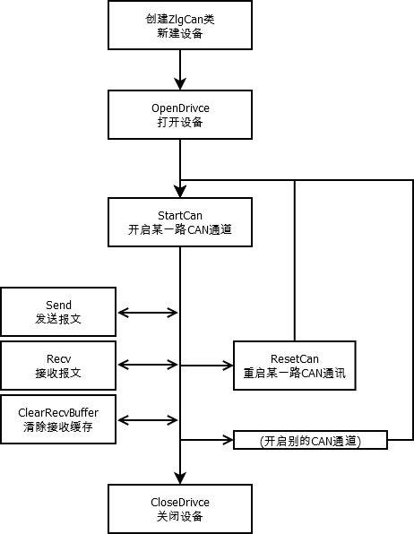

# ZLGCanControl

---
---

## 简单介绍
用python对周立功提供的dll文件进行包装,以更友好的方式,实现利用Python控制周立功CAN卡的功能。
* 支持周立功大部分CAN卡.
* 工程已带周立功提供的库文件,模块自动识别64bit和32bit的Windows系统.
* 模块引用的全部是标准库,未使用未任何第三方库,方便使用.
* Python环境要求: Python3.7+


## 文件结构介绍
* ControlCAN.py
    >   模块核心文件,通过本文件实现模块功能.
* doc文件夹            
    >   相关文档.
* demo文件夹         
    >   模块使用示例.
* ControlCANx64文件夹  
    >   ZLG提供的64bit库文件.
* ControlCANx86文件夹  
    >   ZLG提供的32bit库文件.
* README.md文件        
    >   本文件

## 类介绍
### VCI
#### 说明
* 周立功DLL支持的接口卡列表.
* 此为枚举变量,每个接口卡对应一个变量,变量值为DLL里的驱动编号.
* 直接引用,不可实例化.

### CanObj
#### 说明
* 收发CAN报文时,用来装载数据的结构体.
* 此类,继承Structure类.对应ZLG的DLL里 VCI_CAN_OBJ 结构体.
#### 变量
#### 方法Load
* 原型
```python
    def Load(self,ID,Data,Ext=None,Remote=None,SendType=None):
```
* 特别注意了,Data需要传入一个长度小于8的元组,重要的事情说三遍:元组!元组!元组!长度小于8!长度小于8!长度小于8!

### ZLGCanControl
#### 类的实例化
```python
from ControlCAN import ControlCAN
can = ControlCAN(can_devtype, can_devindex, can_canindex, can_baudrate, can_acccode, can_accmask)
```
通过以上代码可以实例化一个 ControlCAN 类，对 CAN 卡的所有控制函数都写在类的方法中，方法命名对应周立功手册内的函数，包括传入参数均与周立功手册相同。
实例化的过程中会自动调用 __init__ 方法，传入参数分别为 设备类型 can_devtype、设备号 can_devindex.
#### OpenDrivce
#### CloseDrivce
```python
del can
```
删除实例时会自动调用 __del__ 方法，此方法会关闭 CAN 卡
#### StartCAN
#### ResetCAN
#### Send
#### Recv
#### logging
#### 异常处理

## 操作使用流程
### 流程图

      

### 操作说明

```python
from ControlCAN import VCI,CanObj,ZlgCan
can = ControlCAN(can_devtype, can_devindex, can_canindex, can_baudrate, can_acccode, can_accmask)
```
* *
* a
* a
* a
* a
## 关于版权
* 版权就是没有版权.如果是用来研究CAN通讯的话,随便用,千万不要客气.
* 如果可以,还请都留下个必要的声明,给我刷个存在感.
* 我希望在未来的某一天,我在江湖上行侠仗义的时候,能听到有人在讨论:卧槽,这只北极的破企鹅,又在搞事情了.

## 其他
* 在网上，很容易就能找到类似的库，包括周立功官网也提供了python二次开发的demo,我都大概看了,感觉有点不太好用.我有强迫症,必须要自己来舒服,于是呢,就有现在这个了.


